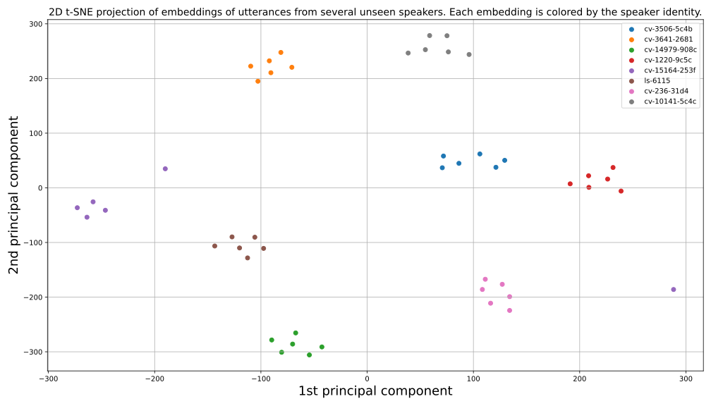
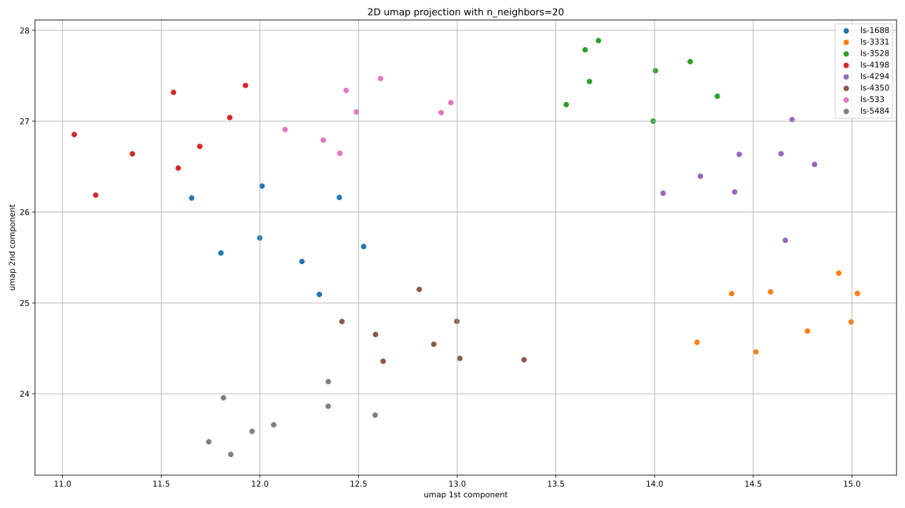
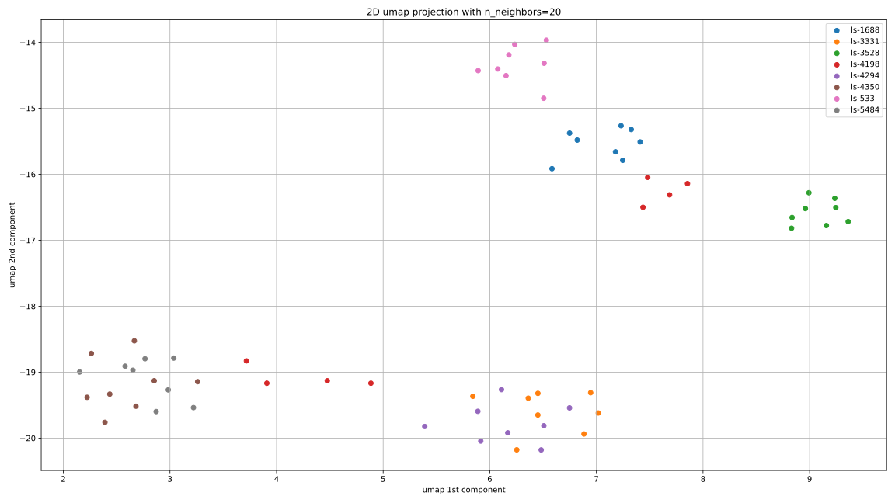

# Simple speaker embeddings
A speaker embedding network in Pytorch that is very simple to use and modify for whatever purposes.

**Update Dec 2021**: new training, 16kHz pretrained model, logging, and EER benchmarks now added.

## What?
Pytorch models that takes in a waveform or log Mel-scale spectrogram and returns a 256-dimensional real vector of unit length known as an _embedding_ for the input speaker.
The vector is trained to be unique to the speaker identity of the input utterance -- so the returned vector should remain the same regardless of _what_ words are spoken in the input utterance, and depend only on the _speaker identity_ of who is speaking in the input utterance.

For example, if an input utterance saying "The quick brown fox" spoken by **speaker A** is fed into the model, the resulting 256-dimensional embedding should be close (in terms of cosine/Euclidean distance) to the embedding of an utterance saying "I like speaker embeddings" also spoken by **speaker A**. 
Conversely, the embedding should be far away (in terms of cosine/Euclidean distance) from the embedding of an utterance saying the same "The quick brown fox" spoken by **speaker B**.
Thus the embedding should be unique to the identity of the speaker of an input utterance, and not the linguistic content of the input utterance.
This is the behavior provided by the models in this repo.

## Models
This repo provides two pretrained models:
1. A `GRU` recurrent model (3 layers, 786 hidden units each) which operates on log Mel-scale spectrogram frames computed from 22.05kHz sampled audio.
2. A `ConvGRU` model which consists of an initial convolutional encoder network into a GRU (3 layers, 786 hidden units each). This network operates on raw, un-normalized 16kHz waveforms. 

These are summarized below, where the speaker embeddings are of dimension d:

| torchub model | sample rate | training datasets | input format | d | release |
| ----------- | ----------- | --- | --- | --- | --- |
| `gru_embedder`      | 22.05khz | VCC 2018, VCTK, Librispeech, CommonVoice English | log mel-scale spectrogram | 256 | [Nov 2020](https://github.com/RF5/simple-speaker-embedding/releases/tag/0.1) |
| `convgru_embedder`   | 16kHz | VCTK, Librispeech, voxceleb1, voxceleb2 | raw waveform | 256 | [Dec 2021](https://github.com/RF5/simple-speaker-embedding/releases/tag/v1.0) |

**Quick info**:
- The input utterance can be of arbitrary length, although fairly short (5-10s) work best.
- Speaker embeddings can be made more robust by taking the mean embedding from multiple utterances from the same speaker. Finally, scale the mean vector to again be of unit length. 
- The pretrained model works reasonably well on _unseen_ speakers. In other words, it generates reasonable and well-behaved embeddings for utterances by speakers never seen during training. You may improve it by fine-tuning on a new dataset, but it isn't strictly necessary.
- The model is trained with the [GE2E loss](https://arxiv.org/abs/1710.10467) introduced for speaker verification, using the loss function [implementation provided by HarryVolek](https://arxiv.org/abs/1710.10467)
- The log Mel-scale spectrogram transform used for the `gru_embedder` is based on the ones used by Tacotron, and the transform functionality is bundled with the model in pytorch hub for the GRU model which operates on spectrograms.

# Quick start
No cloning repos or downloading notebooks needed! Simply:
1. Ensure you have `pytorch`, `torchaudio`, `librosa`, `numpy`, `scipy`, and `omegaconf` python packages installed (`umap`, `sklearn`, and `matplotlib` also required for training/benchmarking). 
2. Run: 
   ```python
    import torch
    # for the new model
    model = torch.hub.load('RF5/simple-speaker-embedding', 'convgru_embedder')
    # for the original model
    # model = torch.hub.load('RF5/simple-speaker-embedding', 'gru_embedder')
    model.eval()
   ```
   For the `convgru_embedder`, feed in `(batch size, samples)` waveform samples and obtain `(batch size, 256)` embedding vectors. 
   For the `gru_embedder`, feed in `(batch size, frames, 80)` log Mel-spectrogram tensors and obtain `(batch size, 256)` embedding vectors. 
   
   Trivial!

## Example
Lets go through a full example to show what's cracking for the `gru_embedder` model.
First, assume you have an audio file `example.wav` ([like the `example.wav` in this repository](https://github.com/RF5/simple-speaker-embedding/raw/master/example.wav)) that is spoken by a speaker you would like an embedding of.
So, first step is to create the model and load the weights:

```python
import torch
model = torch.hub.load('RF5/simple-speaker-embedding', 'gru_embedder')
model.eval()
```
This loads the pretrained model as a standard pytorch module. If you would like the untrained model, simply specify `pretrained=False` in the arguments for `torch.hub.load`. 

Now, we load the waveform to a log Mel-scale spectrogram:
```python
mel = model.melspec_from_file('example.wav')
# if you were using the `convgru_embedder`, you can go:
# import librosa
# wav, _ = librosa.load('example.wav', sr=16000)
# wav = torch.from_numpy(wav).float()
```
Alternatively, if you already have a loaded waveform as a 1D Pytorch float tensor between -1 and 1, then you can also use `mel = model.melspec_from_array(x)` for 1D torch vector `x`. 

Finally, we can get the embedding by running the spectrogram through the model:
```python
embedding = model(mel[None]) # include [None] to add the batch dimension
# or, for convgru_embedder:
# embedding = model(wav[None])
```
`embedding` is now a rank 1, 256-dimensional tensor of unit length corresponding to the identity of the input speaker.

# Does it work?
Yes, to a pretty good extent. For example, below we plot the 2D t-SNE projection of several embeddings from utterances spoken by several speakers unseen during the training of the `gru_embedder` model. Each embedding is colored by the speaker identity of the corresponding utterance.



As is seen, utterances spoken by the same speaker are closely clustered, while utterances by different speakers remain well separated. This indicates good embedding behavior.

## Performance
Performance is given on Librispeech (LS) `test-clean` and `test-other` datasets and on the voxceleb1 `test` dataset. These datasets consist of completely unseen speakers to all the models.
Concretely, all speakers included in this evaluation are not seen during training or validation.
Furthermore, the test utterances are not cropped or reduced in length, but rather the model is applied directly to the full length waveform.
This means that the test results here are pessimistic. You will obtain better numbers by cropping utterances to reasonable lengths (4-8s), and taking the mean speaker embedding from multiple utterances or multiple parts of a single long utterance, or both, and then only using this mean embedding vector when comparing to embeddings for other speakers. 

| model | LS test-clean EER (%) | LS test-other EER (%) | voxceleb1 test EER |
| ----------- | :-----------: | :----: | :---: |
| `gru_embedder`      | 7.97 | 7.66 | 33.77 |
| `convgru_embedder`   | 2.95 | 1.81 | 3.20 |

We can also compare the model performance for the same set of unseen speakers side-by-side. Namely, below is a 2D UMAP projection for several embeddings colored by speaker where each point is the embedding for a particular utterance. 

### convgru_embedder umap projection for zero-shot speakers



### gru_embedder umap projection for zero-shot speakers




## Failure modes
The model is not perfect and fails under some conditions:
- If the input utterance contains multiple people talking, it will not generate sensible embeddings.
- If the input utterance is very long (>30s), then the model also becomes rather unstable.
- If the input utterance contains long portions of silence then the resulting embeddings lose meaning. 

# Data hyperparameters
The input to each model has certain hyperparameters for how it should be preprocessed before feeding it to the model.

## 16kHz model: ConvGRU embedder
The ConvGRU model only assumes that any input waveform are floating point numbers between -1.0 and 1.0 sampled at 16kHz. You may wish to normalize the volume to ensure very soft audio is scaled up, but it is not strictly necessary and performance will still be good.

## 22.05kHz model: GRU embedder
For the 22.05kHz GRU model operating on mel-spectrograms, the hyperparameters correspond to the choices for computing and normalizing the mel-spectrogram transform. To view them, simply go `model.print_hparams()`. It will return something like:
```python
filter_length  :  1024
hop_length  :  256
win_length  :  1024
n_mel_channels  :  80
sampling_rate  :  22050
mel_fmin  :  0
mel_fmax  :  8000.0
min_log_value  :  -11.52
```
All this information pertains to the settings of the Tacotron Mel-spectrogarm transform, except for the `min_log_value`, which is used by the model to normalize any input log Mel-scale spectrograms. 
You can disable this scaling by providing the `normalize=False` argument in the `torch.hub.load` call -- in which case the `model.forward()` method assumes the input has already been scaled using this `min_log_value` to roughly be between -1 and 1.

When using `melspec_from_file('example.wav')`, `example.wav` is automatically resampled to the correct sampling rate. However, if obtaining the mel-spectrogram from a torch array, please remember to resample the utterance first to 22050Hz. 

# Training
The latest model is trained on VCTK, Librispeech, voxceleb1 and voxceleb2. To train the model, what you need is a csv of the following format:

```csv
path,speaker
<path to wav>,<speaker id>
<path to wav>,<speaker id>
```
Where the `path` is a file path to a wav/flac/mp3 or other audio file, and `speaker` is the speaker name/id to which that waveform path belongs. For best results, ensure that each speaker has at least 20+ waveforms associated with it. 

## Constructing data
The `split_data.py` script constructs a training and validation csv of this format from the datasets specified above. Namely it has the available arguments:

```
split_data.py  [--librispeech_path LIBRISPEECH_PATH] [--vctk_path VCTK_PATH]
               [--commonvoice_path COMMONVOICE_PATH] [--vox1_path VOX1_PATH]
               [--vox2_path VOX2_PATH] [--seed SEED] [--valid_spks VALID_SPKS]
```

If a path to a dataset is specified, its associated waveforms are included in the train/validation csvs it produces. It should be fairly trivial to modify this for your own custom speech dataset format.

## Training and logging
The `train.py` script trains the model. It has additional dependencies: `omegaconf`, `fastprogress`, `pandas`. 
To see all settings and config options, just run `python train.py --help`. All config options can be set or overridden with command line arguments. For example, training the convolutional GRU model was done with:

```bash
python train.py checkpoint_path=runs/sse2 train_csv=splits/train.csv.zip  \
                valid_csv=splits/valid.csv.zip max_seq_len=120000 fp16=True \
                batch_size=9 distributed.n_gpus_per_node=3 start_lr=1e-8 \
                max_lr=4e-5 end_lr=1e-7 n_epochs=2000 validation_interval=2500
```

And the full tensorboard training logs (except umap projections) are available on [tensorboard.dev at this link :).](https://tensorboard.dev/experiment/l651ZgIJRwOESVCMYGzdmA/)

The train script supports both single and multi-GPU training, FP16 training, gradient clipping, tensorboard logging and more. Please see the `--help` command for all config options. The required arguments are:
- `checkpoint_path` -- the path on which to log tensorboard metrics and save checkpoints.
- `train_csv` -- data csv for training.
- `valid_csv` -- data csv for validation. 

Once training is complete, you can strip out unnecessary parts of the checkpoint for inference with the `strip_checkpoint` method of `ConvGRUEmbedder` in `ge2e_embedding.py`.
E.g.: 
```python
from train import TrainConfig, DistributedConfig
ConvGRUEmbedder.strip_checkpoint('ckpt_00700000.pt', 'ckpt_00700000_strip.pt')
```
This stripped checkpoint can then be directly loaded into a ConvGRUEmbedder model:
```python
model = ConvGRUEmbedder(device='cuda')
ckpt = torch.load('ckpt_00700000_strip.pt')
model.model.load_state_dict(ckpt['model_state_dict'])
model.eval()
```

## Evaluation
Check out the `eval.py` script for this.
You specify which model and which test csv you would like (of the same format as used for `train.py`), and it will:
- Compute the equal error rate (EER) 
- Plot a [UMAP](https://umap-learn.readthedocs.io/) scatter plot of a few sample embeddings belonging to different utterances

## Old training procedure
The older GRU model trained on log Mel-scale spectrograms is trained on the combined VCC 2018, VCTK, Librispeech, and CommonVoice English datasets, using Fastai. 

To train the model:
1. Download these datasets
2. Precompute the log Mel-scale spectrograms for every utterance in each dataset
3. Save these precomputed spectrograms in a different folder for each dataset, with subfolders for each speaker.
4. Run the code in the training notebook `training.ipynb`

